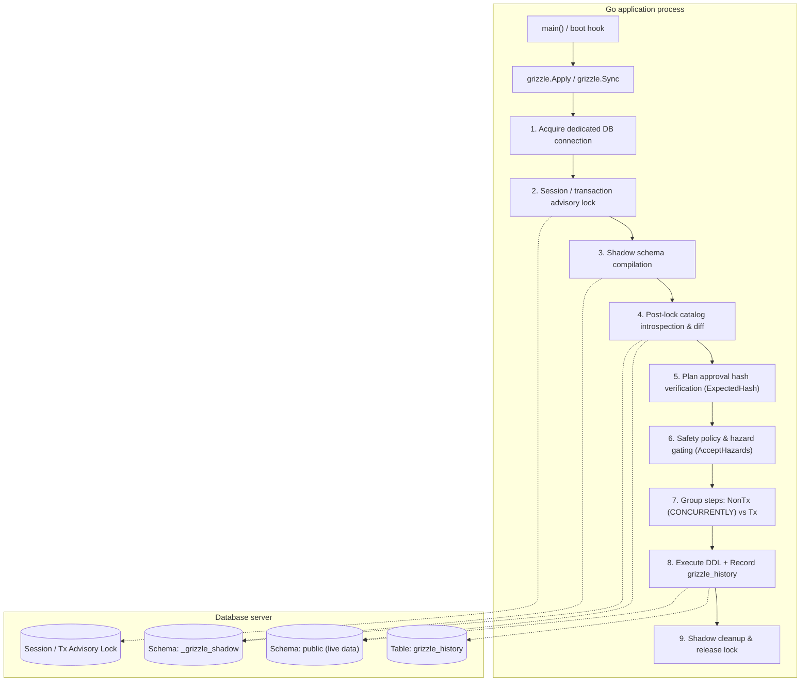
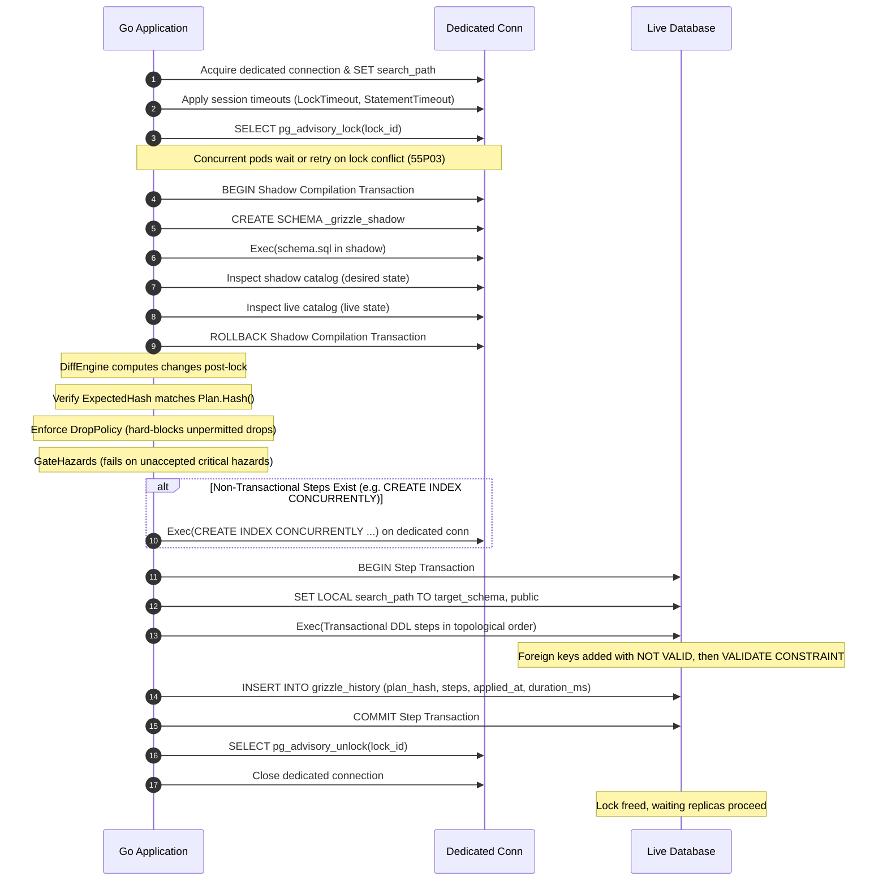

# Grizzle architecture

This document details the architectural design, lifecycle, component interactions, and dependency rules of Grizzle.

## 1. Layered dependency rule

Grizzle follows a strict functional core, imperative shell design enforced across packages:

```
schema  <--  scope, diff, plan  <--  dialect  <--  exec, history  <--  grizzle (root facade)
```

| Layer | Packages | Responsibility | Purity Rule |
| :--- | :--- | :--- | :--- |
| **Model** | `internal/schema` | Pure relational model: `Table`, `Column`, `Index`, `Constraint`, `Schema`, normalization | **Pure**: No `database/sql`, no `context`, no I/O, no globals |
| **Logic** | `internal/scope`<br>`internal/diff`<br>`internal/plan` | Scope filtering, AST schema diffing, topological sort, `Plan.Hash()`, structural hazard analysis | **Pure**: Deterministic algorithms, sorted maps/slices for stable hashing |
| **Dialect** | `internal/dialect`<br>`internal/dialect/postgres`<br>`internal/dialect/sqlite` | SQL DDL rendering, catalog introspection queries, advisory locks, 12-step rebuild | Only layer with dialect-specific SQL syntax knowledge |
| **Execution** | `internal/exec`<br>`internal/history` | Connection management, shadow schemas, session/transaction locking, statement timeouts, retries, history audit log | Handles I/O, transactions, retries, and errors |
| **Facade** | root (`grizzle`) | Public API (`Sync`, `PlanDiff`, `Apply`, `Check`), options validation, public type aliases | Wiring only; zero core logic |

An automated test (`TestArchitecture_LayeredDependencies`) verifies that no package violates this one-way dependency rule.

## 2. High-level execution flow



## 3. Detailed sequence: Locking, post-lock diffing, and execution



## 4. Core components

### 4.1 Lock manager & retry loop
* **Mechanism**: PostgreSQL session advisory locks on dedicated connections for non-transactional operations (`CREATE INDEX CONCURRENTLY`), and transactional advisory locks (`pg_advisory_xact_lock`) for pure transactional plans.
* **Conflict handling**: If PostgreSQL returns `55P03` (`lock_not_available` or `lock_timeout`), Grizzle retries with truncated exponential backoff and randomized jitter up to `Options.MaxRetries`.
* **Connection safety**: Dedicated connections ensure that session locks are released in `defer` handlers or automatically cleaned up if the connection drops.

### 4.2 Shadow runner
* **Mechanism**: Compiles `SchemaSQL` in `_grizzle_shadow` (PostgreSQL) or `:memory:` (SQLite) to validate SQL constraints and syntax before touching production tables.
* **Safety**: Zero live tables are modified during compilation.

### 4.3 Catalog inspector & diff engine
* **Mechanism**: Inspects relational catalogs (`pg_catalog` or `sqlite_schema`) post-lock.
* **Pure AST Diffing**: Compares tables, columns, constraints, enums, and indexes. Sorts all outputs stably.
* **Expand/Contract Detection**: Unmapped dropped and added columns with matching types trigger `HazardRenameAmbiguous`. Explicit mappings in `Options.Renames` generate atomic `RENAME COLUMN` or staged non-destructive column additions when `ExpandContract: true`.

### 4.4 Hazard analyzer & gatekeeper
* **Purity**: Structural inspection without SQL string parsing.
* **Enforcement**: Blocks execution if any critical hazard (`DROP_TABLE`, `DROP_COLUMN`, `TYPE_NARROW`, `RENAME_AMBIGUOUS`) is not present in `Options.AcceptHazards`.
* **Policy Invariant**: `AllowDrop: false` is checked first and hard-blocks deletions regardless of hazard acceptance.

### 4.5 Execution engine & history recorder
* **Step Grouping**: Automatically splits migration plans into transactional blocks and non-transactional blocks (`CONCURRENTLY` index creations).
* **Safe Constraints**: Foreign keys are created as `ADD CONSTRAINT ... NOT VALID` and subsequently validated with `VALIDATE CONSTRAINT` to prevent prolonged exclusive table locks.
* **Audit Trail**: Every successfully applied plan writes a record to `grizzle_history` containing the deterministic plan hash, execution timestamp, duration, applied user, and steps JSON.
