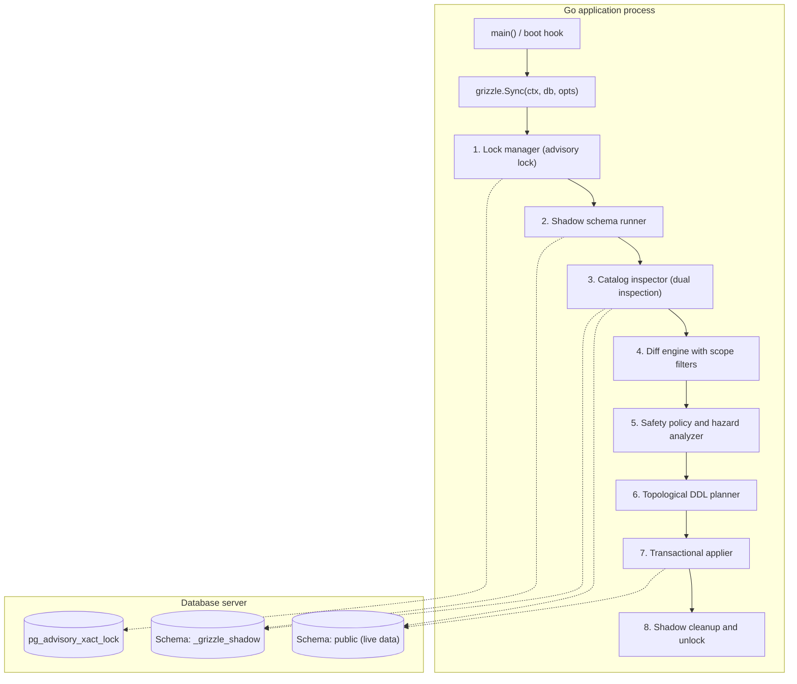
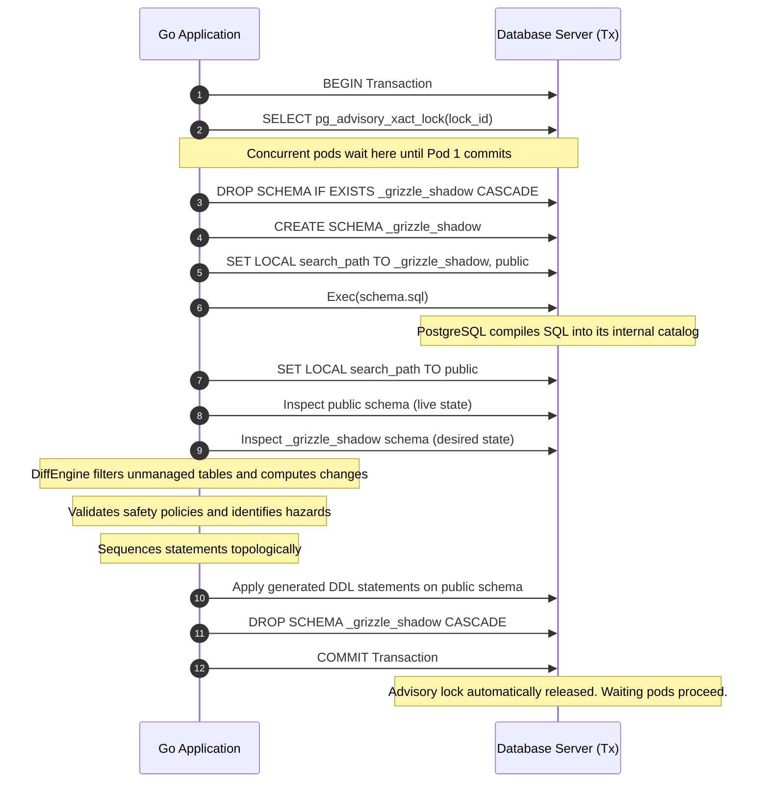

# Grizzle architecture

This document details the architectural design, lifecycle, and component interactions of Grizzle.

## 1. High-level architecture

Grizzle operates as an embedded in-process library inside the Go application runtime. It does not spawn background daemons, launch child processes, or query external CLI binaries.

## 2. In-process shadow schema validation

Parsing arbitrary SQL DDL text in application code is error-prone because database dialects contain complex grammars for custom enums, interval expressions, partial indexes, and generated columns.

Grizzle avoids custom SQL parsing by using the database engine itself as the compiler:

On SQLite, the shadow compilation runs inside an in-memory database (`sql.Open("sqlite", ":memory:")`), verifying SQL statements without affecting disk files.

## 3. Core components

### 3.1 Lock manager
* **Purpose**: Coordinates concurrent replicas during rolling cluster deployments.
* **Mechanism**: PostgreSQL Transactional Advisory Locks (`pg_advisory_xact_lock`).
* **Guarantees**:
  * Bound directly to transaction lifecycle.
  * No custom lock tables or polling daemons.
  * Automatically released on transaction commit, rollback, process crash, or network termination.

### 3.2 Shadow runner
* **Purpose**: Compiles the user's `schema.sql` in isolation without touching live production tables.
* **Mechanism**: PostgreSQL uses an ephemeral schema named `_grizzle_shadow` with localized `search_path`. SQLite uses an isolated `:memory:` database instance.
* **Cleanup**: Uses deferred execution to ensure the shadow schema is dropped even if errors occur during compilation.

### 3.3 Catalog inspector
* **Purpose**: Extracts relational metadata from live and shadow schemas.
* **Source**:
  * PostgreSQL: Direct queries against `pg_catalog` (`pg_class`, `pg_attribute`, `pg_constraint`, `pg_index`, `pg_type`).
  * SQLite: Queries against `sqlite_schema`, `PRAGMA table_info`, and `PRAGMA foreign_key_list`.
* **Entities extracted**: Tables, columns, data types, nullability, defaults, primary keys, indexes, foreign keys, and enum definitions.

### 3.4 Table scope filter
* **Purpose**: Protects third-party tables from modification or deletion.
* **Mechanism**: Evaluates table names against:
  * Built-in extension ignore lists (such as PostGIS `spatial_ref_sys`, `geometry_columns`).
  * User-defined `ExcludeTables` wildcard patterns (such as `asynq_*`, `temporal_*`).
  * User-defined `IncludeTables` whitelists.

### 3.5 Diff engine
* **Purpose**: Compares live state against desired state and produces atomic schema operations.
* **Operations**: Table creations, table drops, column additions, column drops, column alterations (type, nullability, default), index creations, index drops, foreign key additions, foreign key drops, and enum modifications.

### 3.6 Safety policy and hazard analyzer
* **Purpose**: Prevents accidental data destruction and flags operational risks before execution.
* **Policies**:
  * `AllowDrop: false` blocks all destructive operations (`DROP TABLE`, `DROP COLUMN`, destructive type conversions).
  * Granular overrides allow targeted operations (`AllowDropIndex: ptr(true)`).
* **Hazard levels**:
  * `CRITICAL`: Potential data loss (`DROP TABLE`, `DROP COLUMN`, destructive type narrowing).
  * `WARNING`: Execution failures on non-empty tables (adding `NOT NULL` without `DEFAULT`).
  * `NOTICE`: Operational impacts (index creation table locks, index drops, foreign key drops).

### 3.7 Topological DDL planner
* **Purpose**: Sequences migration statements to satisfy relational constraints:
  1. Drop foreign keys (removes cross-table locks and dependency blocks)
  2. Drop indexes (removes obsolete indexes)
  3. Create tables (creates empty tables before foreign keys reference them)
  4. Add columns (widens existing tables)
  5. Alter columns (changes types, nullability, defaults)
  6. Create indexes (adds new query paths)
  7. Add foreign keys (links parent and child tables)
  8. Drop columns (if permitted by policy)
  9. Drop tables (if permitted by policy)

### 3.8 SQLite 12-step rebuild engine
Because SQLite does not support altering or dropping existing columns natively, Grizzle implements SQLite's recommended 12-step table recreation procedure:
1. Disable foreign key checks (`PRAGMA foreign_keys = OFF`).
2. Create replacement table `_grizzle_rebuild_<table_name>`.
3. Copy compatible columns (`INSERT INTO ... SELECT ...`).
4. Drop old table.
5. Rename replacement table to original name.
6. Re-create indexes and triggers.
7. Verify referential integrity (`PRAGMA foreign_key_check`).
8. Re-enable foreign keys (`PRAGMA foreign_keys = ON`).

## 4. Concurrency and recovery guarantees

| Scenario | Behavior | Guarantee |
| :--- | :--- | :--- |
| **Simultaneous startup (10 pods)** | Pod 1 acquires `pg_advisory_xact_lock`. Pods 2 to 10 wait on lock. | Exactly one migration execution. No race conditions. |
| **Subsequent pod execution** | Pod 1 commits. Pod 2 acquires lock, inspects schema, detects 0 diffs, exits in < 15ms. | Zero redundant DDL statements executed. |
| **Application crash during sync** | Database connection closes. Database rolls back transaction and frees advisory lock. | Zero partial schema states. No deadlocks. |
| **Syntax error in `schema.sql`** | Compilation fails in shadow schema before touching live schema. | Live database remains untouched. |
