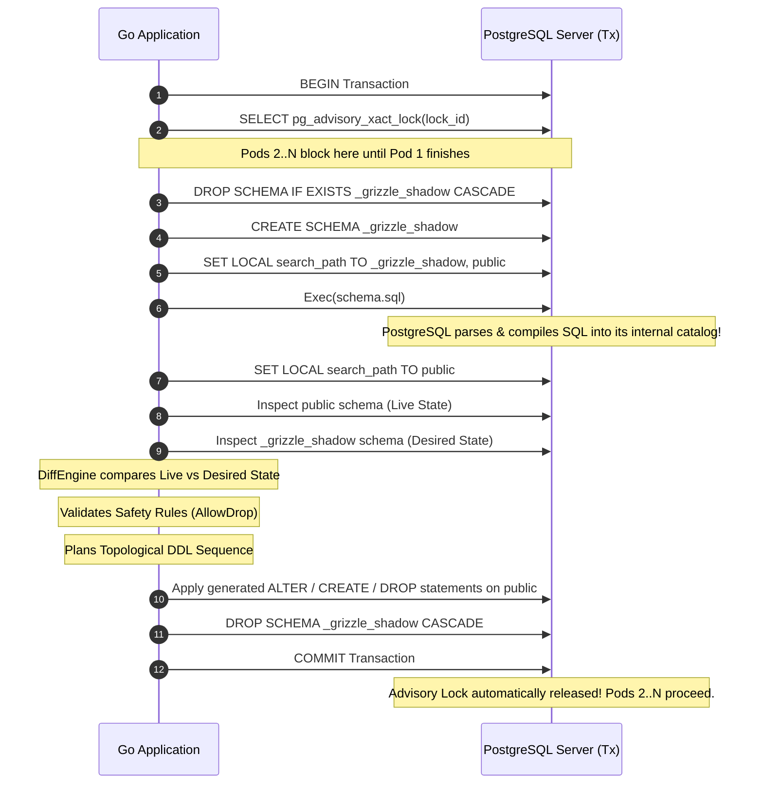

# Grizzle Architecture

This document details the architectural design, lifecycle, and component interactions of **Grizzle**.

---

## 1. High-Level Architecture

Grizzle operates as an embedded in-process library inside the Go application runtime. It does not spawn background daemons, launch child processes, or query external CLI binaries.

```mermaid
flowchart TD
    subgraph Go Application Process [Go Application Process (Startup)]
        AppMain["main() / Boot Hook"] --> SyncCall["grizzle.Sync(ctx, db, opts)"]
        SyncCall --> LockMgr["1. Lock Manager (Advisory Lock)"]
        LockMgr --> ShadowRunner["2. Shadow Schema Runner"]
        ShadowRunner --> Inspector["3. Catalog Inspector (Dual Inspection)"]
        Inspector --> DiffEngine["4. Diff Engine"]
        DiffEngine --> SafetyGuard["5. Safety & Destructive Guards"]
        SafetyGuard --> Planner["6. Topological DDL Planner"]
        Planner --> Applier["7. Transactional Applier"]
        Applier --> Cleanup["8. Shadow Schema Cleanup & Unlock"]
    end

    subgraph Target Database [PostgreSQL Target Database]
        AdvisoryLock[("pg_advisory_xact_lock")]
        ShadowSchema[("Schema: _grizzle_shadow")]
        PublicSchema[("Schema: public (Live Data)")]
    end

    LockMgr -.-> AdvisoryLock
    ShadowRunner -.-> ShadowSchema
    Inspector -.-> ShadowSchema
    Inspector -.-> PublicSchema
    Applier -.-> PublicSchema
```

---

## 2. The In-Process Shadow Schema Pattern

The hardest part of declarative database management is parsing arbitrary SQL DDL. Writing a parser in Go that handles PostgreSQL dialect specifics (e.g., custom enums, complex defaults, partial indexes, generated columns) is brittle and error-prone.

Grizzle avoids parsing SQL text entirely by using PostgreSQL itself as the compiler:



---

## 3. Core Component Breakdown

### 3.1 Lock Manager
* **Purpose**: Guarantees that only a single instance of the application executes migrations during multi-replica deployments (e.g. Kubernetes rolling updates).
* **Mechanism**: PostgreSQL Transactional Advisory Locks (`pg_advisory_xact_lock`).
* **Properties**:
  * Bound to the transaction lifecycle.
  * Does not require custom lock tables or heartbeat workers.
  * Automatically released if the app crashes, panics, or the connection is severed.

### 3.2 Shadow Runner
* **Purpose**: Executes the user's `schema.sql` in total isolation without touching live production tables.
* **Mechanism**: Creates an ephemeral schema named `_grizzle_shadow` (or configurable prefix) and restricts execution via `search_path`.
* **Cleanup**: Uses deferred execution to ensure the shadow schema is dropped even if errors occur.

### 3.3 Catalog Inspector
* **Purpose**: Extracts the relational structure of both the live schema (`public`) and the shadow schema (`_grizzle_shadow`).
* **Source**: Direct queries against PostgreSQL system catalogs (`pg_class`, `pg_attribute`, `pg_constraint`, `pg_index`, `information_schema`).
* **Extracted Entities**:
  * Tables
  * Columns (name, data type, length, nullability, default expression)
  * Primary Keys
  * Indexes (unique flags, column lists, expressions, predicates)
  * Foreign Keys (referencing table, referencing columns, `ON DELETE`, `ON UPDATE`)

### 3.4 Diff Engine
* **Purpose**: Compares `Live State` vs `Desired State` and generates an unordered list of atomic `Change` actions.
* **Operations Detected**:
  * `CreateTable` / `DropTable`
  * `AddColumn` / `DropColumn` / `AlterColumn` (type, nullability, defaults)
  * `CreateIndex` / `DropIndex`
  * `AddForeignKey` / `DropForeignKey`

### 3.5 Safety & Destructive Guards
* **Purpose**: Protects against accidental data destruction in production environments.
* **Policy**:
  * If `AllowDrop == false` and any `DropTable`, `DropColumn`, or irreversible type change is planned, Grizzle immediately aborts the transaction with a descriptive error.
  * No queries are executed against the live schema if a violation occurs.

### 3.6 Topological DDL Planner
* **Purpose**: Orders migration steps to satisfy relational dependencies.
* **Execution Order**:
  1. Drop Foreign Keys (removes cross-table locks and dependency blocks)
  2. Drop Indexes (cleans up obsolete indexes)
  3. Create Tables (empty tables created without foreign keys first)
  4. Add Columns (expands existing tables)
  5. Alter Columns (adjusts types, nullability, and defaults)
  6. Create Indexes (builds new query paths)
  7. Add Foreign Keys (links parent and child tables)
  8. Drop Columns *(if permitted)*
  9. Drop Tables *(if permitted)*

---

## 4. Concurrency & High Availability Guarantees

| Scenario | Behavior | Guarantee |
| :--- | :--- | :--- |
| **Simultaneous Startup (5 Pods)** | Pod 1 acquires lock, Pods 2–5 block on `pg_advisory_xact_lock`. | Exact-once migration execution. |
| **Subsequent Pods Unblocked** | Pod 1 commits. Pod 2 acquires lock, inspects schema, detects 0 diffs, exits immediately. | Zero redundant DDL executions. |
| **Process Crash During Sync** | Connection terminates; PostgreSQL automatically rolls back transaction and releases lock. | No corrupt partial state, no orphaned locks. |
| **Invalid SQL in `schema.sql`** | Fails in the shadow schema before touching `public`. | Production database remains untouched. |
