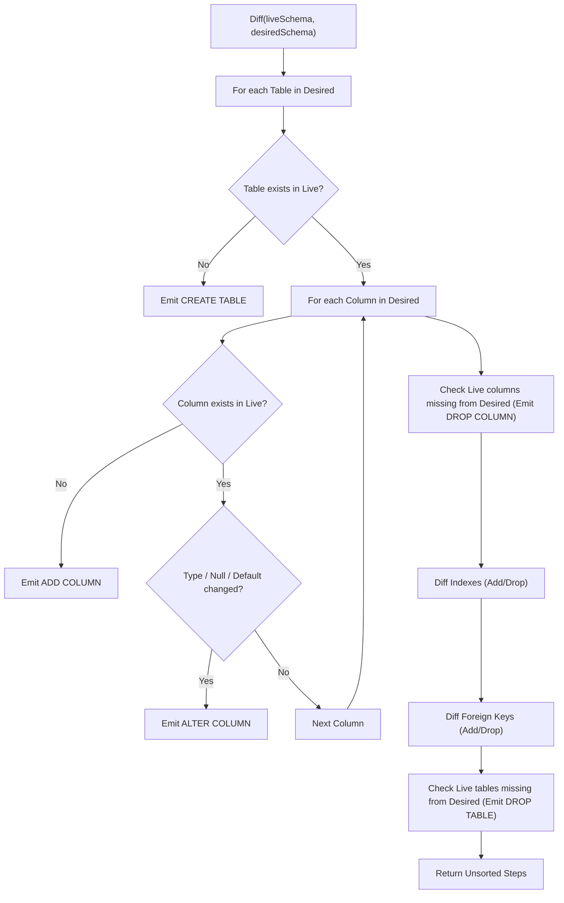

# Grizzle Deep Technical Design

This document details the internal algorithms, data structures, catalog queries, and type normalization strategies used by **Grizzle**.

---

## 1. Internal Representation (IR) Data Structures

```go
package grizzle

import "database/sql"

type SchemaIR struct {
    Name   string
    Tables map[string]*TableIR
    Enums  map[string]*EnumIR
}

type TableIR struct {
    Name        string
    Columns     map[string]*ColumnIR
    Indexes     map[string]*IndexIR
    ForeignKeys map[string]*ForeignKeyIR
    PrimaryKey  *PrimaryKeyIR
}

type ColumnIR struct {
    Name         string
    DataType     string // Normalized (e.g. "bigint", "varchar(255)", "boolean")
    IsNullable   bool
    DefaultValue string // Sanitized, stripped of Postgres casts (e.g., 'active' instead of 'active'::character varying)
    Position     int
}

type IndexIR struct {
    Name       string
    TableName  string
    IsUnique   bool
    Definition string // Normalized DDL expression
}

type ForeignKeyIR struct {
    Name       string
    TableName  string
    Definition string // Normalized constraint definition (e.g. "FOREIGN KEY (user_id) REFERENCES users(id) ON DELETE CASCADE")
}

type PrimaryKeyIR struct {
    Name    string
    Columns []string
}

type EnumIR struct {
    Name   string
    Values []string
}
```

---

## 2. PostgreSQL Catalog Queries

Rather than querying the slow and feature-limited `information_schema`, Grizzle queries `pg_catalog` directly for maximum performance and complete metadata.

### 2.1 Table & Column Extraction
```sql
SELECT
    c.relname AS table_name,
    a.attname AS column_name,
    format_type(a.atttypid, a.atttypmod) AS full_type,
    t.typname AS base_type,
    NOT a.attnotnull AS is_nullable,
    pg_get_expr(d.adbin, d.adrelid) AS column_default,
    a.attnum AS ordinal_position
FROM pg_attribute a
JOIN pg_class c ON c.oid = a.attrelid
JOIN pg_namespace n ON n.oid = c.relnamespace
JOIN pg_type t ON t.oid = a.atttypid
LEFT JOIN pg_attrdef d ON d.adrelid = c.oid AND d.adnum = a.attnum
WHERE n.nspname = $1
  AND c.relkind = 'r'       -- Ordinary tables only
  AND a.attnum > 0          -- Filter out system columns (oid, xmin, etc.)
  AND NOT a.attisdropped    -- Filter out dropped columns
ORDER BY c.relname, a.attnum;
```

### 2.2 Index Extraction
```sql
SELECT
    t.relname AS table_name,
    i.relname AS index_name,
    ix.indisunique AS is_unique,
    pg_get_indexdef(ix.indexrelid) AS index_def
FROM pg_index ix
JOIN pg_class t ON t.oid = ix.indrelid
JOIN pg_class i ON i.oid = ix.indexrelid
JOIN pg_namespace n ON n.oid = t.relnamespace
WHERE n.nspname = $1
  AND NOT ix.indisprimary   -- Primary keys are tracked separately
ORDER BY t.relname, i.relname;
```

### 2.3 Foreign Key Extraction
```sql
SELECT
    c.relname AS table_name,
    con.conname AS constraint_name,
    pg_get_constraintdef(con.oid) AS constraint_def
FROM pg_constraint con
JOIN pg_class c ON c.oid = con.conrelid
JOIN pg_namespace n ON n.oid = c.relnamespace
WHERE n.nspname = $1
  AND con.contype = 'f'     -- Foreign key constraints
ORDER BY c.relname, con.conname;
```

---

## 3. Type Normalization Strategy

One of the most common pitfalls in SQL diffing is **false-positive changes** caused by dialect aliases. PostgreSQL frequently records one string in `pg_type` but outputs another when formatting.

Grizzle applies an explicit normalization pass on all incoming types:

| PostgreSQL Internal | Normalized Grizzle Form | Handled Aliases |
| :--- | :--- | :--- |
| `int4` | `integer` | `int`, `int4`, `serial` |
| `int8` | `bigint` | `int8`, `bigserial` |
| `int2` | `smallint` | `int2`, `smallserial` |
| `bool` | `boolean` | `bool` |
| `varchar(N)` | `varchar(N)` | `character varying(N)` |
| `timestamptz` | `timestamptz` | `timestamp with time zone` |
| `timestamp` | `timestamp` | `timestamp without time zone` |

### Default Value Sanitization
PostgreSQL automatically appends type casts to default expressions:
* Desired: `'active'`
* Catalog returns: `'active'::character varying`
* Desired: `now()`
* Catalog returns: `CURRENT_TIMESTAMP`

Grizzle normalizes defaults by stripping explicit `::type` suffixes and standardizing `CURRENT_TIMESTAMP` to `now()`.

---

## 4. Diffing Algorithm



---

## 5. Topological Sorter (Execution Ordering)

PostgreSQL rejects DDL executed in an arbitrary order (e.g. creating a foreign key to a table that has not been created yet). 

Grizzle sorts all generated `MigrationStep` items using a strict priority ladder:

```go
const (
    PriorityDropFK      = 10  // Remove FKs first to unlock tables
    PriorityDropIndex   = 20  // Remove obsolete indexes
    PriorityCreateTable = 30  // Create bare tables (PKs included, FKs deferred)
    PriorityAddColumn   = 40  // Add new columns
    PriorityAlterColumn = 50  // Alter column types / constraints
    PriorityCreateIndex = 60  // Build new indexes
    PriorityAddFK       = 70  // Add foreign keys once all tables and columns exist
    PriorityDropColumn  = 80  // Drop columns (if allowed)
    PriorityDropTable   = 90  // Drop tables (if allowed)
)
```

---

## 6. Deterministic Advisory Locking

To avoid requiring users to manually manage lock IDs, Grizzle derives a deterministic 64-bit integer lock ID from the database name and schema name using FNV-1a hashing:

```go
func GenerateLockID(dbName, schemaName string) int64 {
    h := fnv.New64a()
    h.Write([]byte(dbName + ":" + schemaName))
    return int64(h.Sum64())
}
```
This guarantees that different databases or schemas on the same PostgreSQL cluster never block each other, while instances of the same service synchronize safely.
